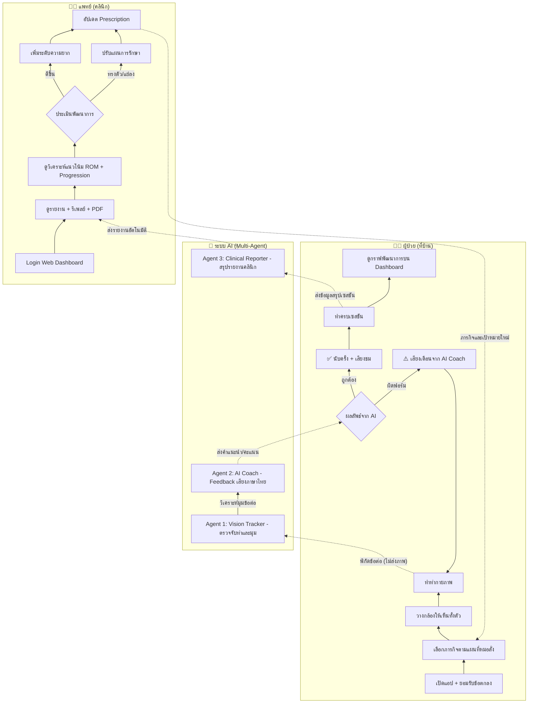

# 🏋️ AI Physio — AI-Driven Home Rehabilitation & Physical Therapy Tracker

ระบบกายภาพบำบัดทางไกล (Telerehabilitation) ที่ใช้กล้องเว็บแคมหรือมือถือตรวจจับท่าทางของผู้ป่วยด้วย AI วัดมุมข้อต่อแบบเรียลไทม์ ให้โค้ชเสียงภาษาไทยแนะนำระหว่างฝึก และส่งรายงานทางคลินิกให้แพทย์/นักกายภาพบำบัดตรวจสอบผ่าน Web Dashboard

> **สถานะ:** ต้นแบบที่ใช้งานได้ครบวงจร (ผู้ป่วยฝึก → ระบบวัดผล → แพทย์ตรวจรายงาน) บน branch `ai-physio` · ค่ามุมเป้าหมายเป็นค่าประมาณของทีมพัฒนา **ยังไม่ผ่านการรับรองโดยนักกายภาพบำบัด** และระบบนี้ **ไม่ใช่เครื่องมือวินิจฉัย**

---

## 🎯 Pain Points ในวงการกายภาพบำบัดที่บ้าน
### 1. คนไข้ทำท่าผิดหรือทำไม่สุดระยะ (Poor Form & Limited ROM)
> [!problem] ปัญหา
> เมื่อคนไข้กลับไปทำกายภาพที่บ้าน มักทำท่าผิดๆ ถูกๆ หรือขยับไม่สุดระยะ (Range of Motion - ROM) ทำให้ฟื้นฟูช้า หรือร้ายแรงกว่านั้นคือ บาดเจ็บซ้ำ (Re-injury) เนื่องจากไม่มีผู้เชี่ยวชาญคอยประกบ

> [!solution] โอกาส Data/AI
> - **Data Capture:** ใช้กล้องเว็บแคม/สมาร์ทโฟน
> - **AI Analytics:** ใช้ `Pose Estimation` ตรวจจับข้อต่อ (Joints) และคำนวณมุม (Kinematics) เพื่อเช็คว่าท่าถูกต้องและสุดระยะหรือไม่

### 2. ขาดแรงจูงใจและการติดตามผลระยะยาว (Lack of Motivation & Long-term Tracking)
> [!problem] ปัญหา
> การทำกายภาพเป็นเรื่องน่าเบื่อ คนไข้มักขาดแรงจูงใจ และแพทย์ไม่สามารถเห็นกราฟพัฒนาการที่ต่อเนื่องระหว่างคาบการรักษาได้

> [!solution] โอกาส Data/AI
> - **Gamification:** ภารกิจรายวัน (Quests), Streak และ Badge จากคะแนนความถูกต้อง
> - **Time-Series & Predictive:** พล็อตกราฟพัฒนาการ ROM/ความแม่นยำ วิเคราะห์แนวโน้ม และ (แผนต่อไป) พยากรณ์ระยะเวลาฟื้นตัวหรือแจ้งเตือนเมื่อพัฒนาการ "แบนราบ" (Plateau)

---

## ✨ ความสามารถของระบบ (ที่ทำเสร็จแล้ว)

### 🧑‍🦯 ฝั่งผู้ป่วย
- **ภารกิจรายวันตามแผนที่แพทย์สั่ง** — ฝึกได้เฉพาะท่าที่ได้รับมอบหมาย (ไม่มี free practice) พร้อมภาพสาธิตท่าแบบเคลื่อนไหว
- **กล้อง + AI วัดมุมข้อต่อแบบเรียลไทม์** — MediaPipe Pose ประมวลผลบนเครื่องผู้ใช้ คำนวณมุมแบบ 3D, กรองสัญญาณสั่น (One Euro filter), แก้ปัญหาซ้าย/ขวาสลับกัน
- **นับครั้ง / เซ็ต และตรวจท่าทางอัตโนมัติ** — ตรวจท่าชดเชย (compensation), ทำไม่สุดระยะ, ความแม่นยำต่ำ
- **Focus Mode** — HUD ตัวใหญ่ (จำนวนครั้ง, เซ็ต, เกจช่วงมุมเป้าหมาย) อ่านได้จากระยะ 2–3 เมตร, เส้นโครงกระดูกเปลี่ยนสีตามสถานะ (เขียว/เหลือง/แดง)
- **โค้ชเสียงภาษาไทย** — พูดเป็นธรรมชาติแบบนักกายภาพ ไม่อ่านตัวเลของศา, เตือนท่าทางเฉพาะช่วงที่กำลังทำท่า (ไม่พูดตอนกลับท่าเริ่มต้น), ไม่พูดซ้อนกัน, ใช้ได้แม้เครื่องไม่มีเสียงภาษาไทย (สังเคราะห์เสียงที่เซิร์ฟเวอร์)
- **บันทึกวิดีโอเฉพาะเมื่อยินยอม** (PDPA, แยกจากความยินยอมทั่วไป ถอนได้ตลอด)
- **แชทกับทีมผู้ดูแล + ผู้ช่วย AI** ที่ตอบตามหลักกายภาพบำบัด และส่งต่อทันทีเมื่อพบอาการอันตราย (แนะนำโทร 1669)
- **Dashboard พัฒนาการ** — กราฟแนวโน้ม, Streak, Badge, ประวัติการฝึก

### 👨‍⚕️ ฝั่งแพทย์ / นักกายภาพบำบัด
- **ภาพรวม** — การ์ดสรุป: ฝึกเสร็จวันนี้, รอตรวจสอบ, ความเสี่ยงสูง/Red flags + คิวรายงานรอรับรอง
- **จัดการผู้ป่วย** — HN อัตโนมัติ, ข้อมูลคลินิก, วิเคราะห์แนวโน้มด้วย AI
- **แผนการรักษา (Prescription)** — กำหนดท่า, จำนวนเซ็ต/ครั้ง, วันที่ต้องฝึก และปรับมุมเป้าหมายรายบุคคลได้
- **รายงานคลินิกแบบแท็บ** — สรุปทางคลินิกโดย AI + รับรองผล / ข้อมูลเซสชันดิบ / กราฟมุมข้อต่อ / วิดีโอและรีเพลย์การเคลื่อนไหว (เล่น-หยุด, ปรับความเร็ว, กระโดดไปจุดที่ผิด)
- **ดาวน์โหลด PDF คลิกเดียว** — รูปแบบเอกสารราชการไทย A4 (หัวกระดาษ, เลขที่เอกสาร, HN, ช่องลงนาม) ชื่อไฟล์ `printresult_[รหัสเซสชัน]_[ชื่อผู้ป่วย].pdf`

### 🔐 ระบบและความปลอดภัย
- เข้าสู่ระบบด้วยอีเมล/รหัสผ่าน แยกสิทธิ์ ผู้ป่วย / บุคลากรการแพทย์ และเห็นข้อมูลเฉพาะผู้ป่วยในความดูแล
- **Popup ยินยอมข้อตกลงและ PDPA บังคับ** ก่อนใช้งานทุกฟีเจอร์ (บังคับที่ API ด้วย)
- AI ใช้ผู้ให้บริการฟรี (Groq / Gemini / OpenRouter) สลับอัตโนมัติเมื่อตัวใดล่ม · API key เก็บใน `.env` เท่านั้น

---

## 🧠 Technical Strategy & CPE310 Alignment
### 💡 Dataset Strategy: "ไม่ต้องหา Dataset ภาพเยอะ"
- ใช้ MediaPipe Pose (pre-trained) ดึงพิกัดข้อต่อ แล้วใช้ **เรขาคณิตเวกเตอร์** คำนวณมุม แทนการ train โมเดลเอง — ลดเวลา Data Labeling เกือบทั้งหมด
- ค่ามุมเป้าหมายอ้างอิงช่วง ROM ปกติ (Physiopedia, Soucie et al. 2011) และคำแนะนำท่าจาก AAOS / NHS / CUH; ท่าจากชุดข้อมูลวิจัย **KIMORE** และ **REHAB24-6** ถูกเพิ่มเป็นแบบร่าง (รอตรวจสอบแหล่งอ้างอิง)
- ทุกเซสชันเก็บ snapshot ของสูตรและเป้าหมายที่ใช้ (`algorithmVersion`) ทำให้รายงานย้อนหลังตรวจสอบได้ (Explainable)

### 📊 Phase 1: Core ML/DL & Analytics
1. **Computer Vision (MediaPipe):** Skeleton tracking + มุมข้อต่อ 3D แบบเรียลไทม์ ✅
2. **Time-Series Analysis:** เก็บ ROM และคะแนนความแม่นยำทุกครั้ง พล็อตกราฟแนวโน้ม + วิเคราะห์ slope ✅
3. **Predictive Analytics:** โมเดลพยากรณ์ระยะฟื้นตัว / Risk of Re-injury ⏳ (ยังไม่ทำ — ปัจจุบันเป็นการวิเคราะห์แนวโน้มเชิงสถิติ)

### 🤖 Phase 2: Agentic AI Architecture (Multi-Agent System)
- 📷 **Agent 1: Vision Tracker (The Eyes)** — MediaPipe บนเครื่องผู้ใช้ → พิกัด (x, y, z) → มุมข้อต่อ, นับครั้ง, ตรวจท่าชดเชย ✅
- 🗣️ **Agent 2: AI Coach (The Brain)** — LLM รับ "สถานะเชิงคุณภาพ" ของข้อต่อ (ไม่เห็นตัวเลข) แล้วพูดคำแนะนำภาษาไทยแบบนักกายภาพ ผ่าน TTS ✅ · RAG จากตำรากายภาพ ⏳ (ปัจจุบันใช้หลัก Kisner & Colby ใน prompt)
- 📄 **Agent 3: Clinical Reporter (The Scribe)** — สรุปเซสชันเป็นรายงานคลินิกภาษาไทย + วิเคราะห์แนวโน้มหลายเซสชัน + PDF ✅
- 💬 **Agent 4: Patient Companion** — ผู้ช่วยตอบคำถามผู้ป่วยในแชท พร้อมตรวจจับอาการอันตราย ✅

---

## Flowchart


---

## 🚀 Project Roadmap / สถานะงานรายเฟส

| เฟส | งานที่ทำ | สถานะ |
|---|---|---|
| **0. ต้นแบบ** | ตรวจจับท่าด้วย MediaPipe, แก้เส้นโครงกระดูกไม่ตรง, เครื่องคำนวณมุม 3D | ✅ |
| **1. Backend & ข้อมูล** | PostgreSQL + Prisma migrations, ระบบล็อกอินตามบทบาท, API ที่จำกัดสิทธิ์ตามทีมผู้ดูแล, แผนการรักษา → ภารกิจรายวัน, ท่าพร้อมแหล่งอ้างอิง | ✅ |
| **2. คุณภาพการวัด** | ลดท่าเหลือข้อต่อหลักที่วัดได้แม่น, กรองสัญญาณ, ตรวจท่าชดเชย, คิวรีวิว, แชททีมผู้ดูแล, ภาพสาธิตท่า | ✅ |
| **3. หลักฐานทางคลินิก & AI** | Clinical Session Replay, ท่าจาก KIMORE/REHAB24-6, AI agent (สรุปเซสชัน/แนวโน้ม/ผู้ช่วยผู้ป่วย) บนผู้ให้บริการฟรี, ป้องกันข้อความภาษาไทยเสีย | ✅ |
| **4. ประสบการณ์ฝึก & รายงาน** | โค้ชพูดเป็นธรรมชาติ (ไม่อ่านตัวเลข), พิมพ์รายงาน, บันทึกวิดีโอตามความยินยอม | ✅ |
| **5. ความแม่นยำ & เอกสาร** | แก้ซ้าย/ขวาสลับ + One Euro filter + render loop, รายงาน PDF แบบราชการไทยพร้อม HN | ✅ |
| **6. เสียง & ความยินยอม** | เสียงไทยจากเซิร์ฟเวอร์, Popup ยินยอมบังคับ, ดาวน์โหลด PDF คลิกเดียว, เหลือเฉพาะท่ายืน/นั่ง | ✅ |
| **7. จังหวะการเตือน** | เตือนเฉพาะช่วงทำท่า (ไม่เตือนตอนกลับท่า), cooldown, เสียงเร็วขึ้นและไม่ซ้อนกัน | ✅ |
| **8. UI/UX** | Focus Mode HUD, Dashboard การ์ดสรุป, รายงานแบบแท็บ, ธีมคลินิก slate/teal, ปุ่มรองรับจอสัมผัส | ✅ |
| **9. Predictive Analytics** | พยากรณ์ระยะฟื้นตัว / แจ้งเตือน Plateau | ⏳ |
| **10. ตรวจสอบทางคลินิก** | นักกายภาพรับรองมุมเป้าหมาย, ข้อความยินยอม, ประโยคโค้ช และแหล่งอ้างอิง KIMORE/REHAB24-6 | ⏳ |
| **11. Mobile & Play Store** | PWA/Capacitor, Offline sync, ทดสอบเครื่องจริง, หน้าจัดการสำหรับ Admin | ⏳ |

✅ เสร็จแล้ว · ⏳ ยังไม่ได้ทำ — รายละเอียดเชิงเทคนิคของแต่ละเฟสอยู่ใน [CODEBASE.md](./CODEBASE.md#-development-history)

### 📱 แผน Mobile & Play Store (ยังไม่ได้ทำ)
1. **App Wrapper:** PWA หรือ Capacitor ห่อเว็บ Next.js เป็นแอป Android
2. **On-Device Processing:** MediaPipe รันบนเครื่องอยู่แล้ว ส่งขึ้นเซิร์ฟเวอร์เฉพาะพิกัดข้อต่อ (ลด latency และสอดคล้อง PDPA)
3. **Offline Mode:** คิวซิงค์ข้อมูลเมื่อกลับมาออนไลน์
4. **Play Store:** ขอสิทธิ์กล้อง/ไมโครโฟนตาม Android Guideline, Privacy Policy, ภาพหน้าจอและคำอธิบายแอป

---

## 🛠️ Quick Start

ต้องมี **Bun**, **Docker Desktop** (สำหรับ PostgreSQL) และเบราว์เซอร์ที่มีกล้อง (Chrome / Edge)

```bash
bun install                  # ติดตั้ง dependencies (+ prisma generate)
cp .env.example .env         # ตั้งค่า NEXTAUTH_SECRET และ API key ของ AI (ดูคำอธิบายในไฟล์)

bun run db:up                # เปิด PostgreSQL ด้วย docker compose
bun run db:migrate:deploy    # สร้างตาราง
bun run db:seed              # ข้อมูลตัวอย่าง (⚠️ ล้างข้อมูลเดิมทั้งหมด)

bun run dev                  # เปิด http://localhost:3000
```

**บัญชีทดลอง** (รหัสผ่าน = `SEED_DEMO_PASSWORD` ใน `.env`, ค่าเริ่มต้น `physio-demo-2026`)
- แพทย์ / นักกายภาพ: `doctor@`, `pt@`, `pt2@` + `demo.aiphysio.local`
- ผู้ป่วย: `patient1@`, `patient2@`, `patient3@` + `demo.aiphysio.local`

**ตรวจสอบก่อน commit / deploy:** `bun run typecheck` · `bun run lint` · `bun run build`

---

## 🧰 Tech Stack
Next.js 16 (App Router) · React 19 · TypeScript · Tailwind CSS 4 + shadcn/ui · Zustand · PostgreSQL + Prisma 6 · next-auth · MediaPipe Pose (Web) · Recharts · LLM ผ่าน OpenAI-compatible API (Groq / Gemini / OpenRouter) · Thai TTS · jsPDF · Bun

## 📚 Developer Documentation
> 👉 **สำหรับ developers ที่จะทำต่อ** — อ่าน [CODEBASE.md](./CODEBASE.md): โครงสร้างโค้ด, API endpoints, database schema, สูตรคำนวณมุม, pipeline ของหน้าฝึก, การตั้งค่า และประวัติการพัฒนา
